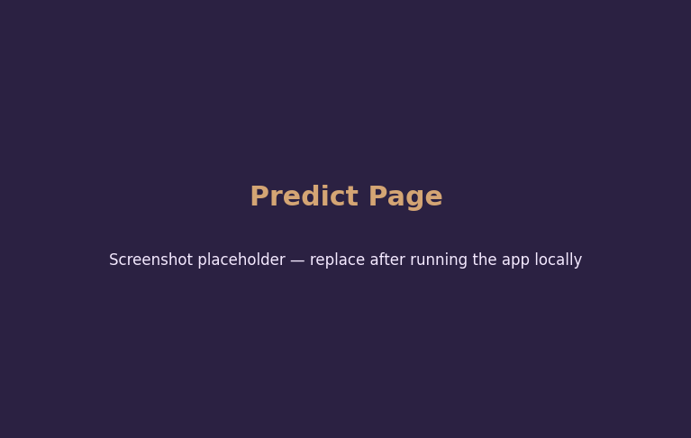
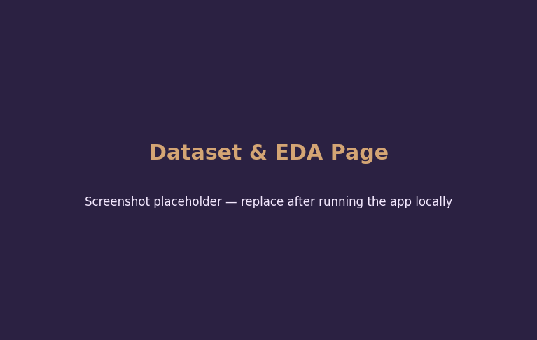
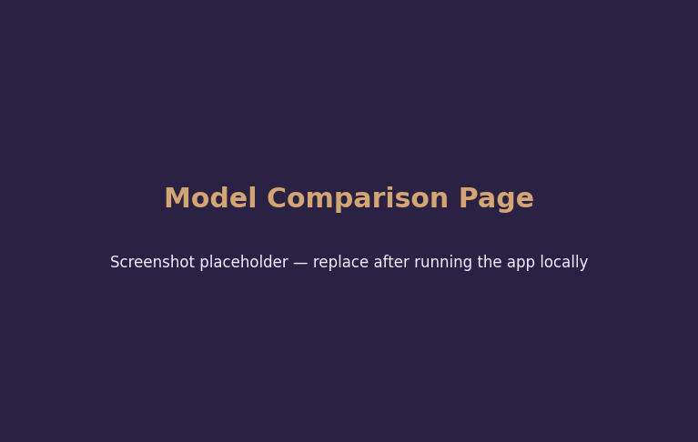

<div align="center">


# 🌸 AI Flower Classification System
## 🌐 Live Demo

👉 **Try the application here:**

https://ai-flower-classification-hutrmffgfzdybauikhtocj.streamlit.app

### An End-to-End Machine Learning Pipeline for Iris Species Classification

**Developed by - Rocky Dutta

[](https://www.python.org/)
[](https://scikit-learn.org/)
[](https://streamlit.io/)
[](LICENSE)
[](tests/)
[](models/metrics.json)
[](app.py)


</div>

---

## ✨ What's New in v2.0.0

A full premium UI/UX redesign on top of the same untouched ML pipeline:

- 🎨 Reworked glassmorphism design system with CSS-variable-driven dark/light theming
- 🌐 Theme choice persists across reloads via URL query parameters
- 🎯 Animated confidence gauge alongside the probability breakdown chart
- 🕒 Prediction timeline + recent-prediction cards in the sidebar-adjacent Predict page
- 📊 Dataset page turned into a collapsible analytics dashboard (grouped EDA sections, summary statistics)
- 🏆 Model Comparison page adds per-model accuracy cards, a best-model highlight, cross-validation and training-summary panels
- 🪪 Portfolio-style About page: developer profile, skills, workflow diagram, features list, roadmap, resume button
- 🟢 Sidebar AI status indicator, live clock, and a rotating ML tip
- ⬆️ Floating scroll-to-top control and a one-time animated splash screen

## 📖 Project Overview

**AI Flower Classification System** is a production-grade supervised learning application that classifies Iris flowers into one of three species — *Setosa*, *Versicolor*, or *Virginica* — based on four physical measurements: sepal length, sepal width, petal length, and petal width.

The project demonstrates a complete, professional machine learning workflow: from raw data ingestion and exploratory analysis, through model training and comparative evaluation, to a polished interactive web dashboard for live predictions. It is built to reflect the standards of a real-world ML engineering deliverable — modular code, reproducible pipelines, automated tests, and a deployable UI.

---

## ✨ Features

### Machine Learning
- Complete ML pipeline: loading → cleaning → EDA → scaling → training → evaluation → persistence
- Four classification algorithms compared: **K-Nearest Neighbors**, **Decision Tree**, **Random Forest**, **Logistic Regression**
- Automated hyperparameter tuning for K (tested across `1, 3, 5, 7, 9, 11, 15, 21`)
- 5-fold cross-validation for robust performance estimates
- Automatic best-model selection based on test accuracy

### Web Application
- 🎨 Modern glassmorphism UI with dark/light theme toggle
- 🔮 Live prediction with confidence score and full probability breakdown
- 📊 Interactive probability charts (Plotly)
- 🕒 In-session prediction history with CSV export
- 📈 Dedicated Dataset & EDA, Model Comparison, and About pages
- 📱 Responsive layout with animated buttons and hover effects

### Engineering Quality
- Modular `src/` architecture with single-responsibility modules
- Full type hints and docstrings throughout
- Automated test suite (`pytest`) covering data, preprocessing, and inference
- Clean `.gitignore`, MIT license, and reproducible `requirements.txt`

---

## 🗂️ Folder Structure

```
AI-Flower-Classification/
│
├── app.py                     # Streamlit web application (entry point)
├── requirements.txt           # Python dependencies
├── README.md                  # Project documentation (this file)
├── LICENSE                    # MIT License
├── .gitignore                 # Git ignore rules
│
├── dataset/
│   └── iris.csv                # Exported copy of the Iris dataset
│
├── images/                     # Auto-generated EDA & evaluation plots
│   ├── histograms.png
│   ├── count_plot.png
│   ├── pair_plot.png
│   ├── correlation_heatmap.png
│   ├── box_plots.png
│   ├── scatter_plot.png
│   ├── feature_distribution.png
│   ├── accuracy_vs_k.png
│   ├── model_comparison.png
│   └── confusion_matrix.png
│
├── models/
│   ├── model.pkl                # Serialized best model + scaler bundle
│   └── metrics.json             # Saved evaluation metrics
│
├── notebooks/
│   └── exploratory_analysis.ipynb
│
├── src/
│   ├── __init__.py
│   ├── data_loader.py           # Dataset loading utilities
│   ├── preprocessing.py         # Cleaning, scaling, splitting
│   ├── visualization.py         # Plot generation (EDA + evaluation)
│   ├── train.py                 # Full training pipeline
│   ├── evaluate.py              # Standalone model evaluation
│   ├── predict.py               # Inference utilities
│   └── utils.py                 # Shared helpers (I/O, persistence)
│
├── tests/
│   ├── __init__.py
│   └── test_pipeline.py         # Automated pytest suite
│
└── assets/
    ├── logo.png
    ├── favicon.ico
    ├── screenshots/             # App screenshots for documentation
    └── css/
        └── style.css            # Custom Streamlit styling
```

---

## 📊 About the Dataset

The project uses the classic **Iris dataset** (Fisher, 1936), loaded directly from `sklearn.datasets`:

| Property | Value |
|---|---|
| Samples | 150 (balanced, 50 per class) |
| Features | 4 (sepal length, sepal width, petal length, petal width — all in cm) |
| Classes | 3 (Setosa, Versicolor, Virginica) |
| Missing values | 0 |
| Duplicate rows | 1 (removed during preprocessing) |

---

## 🧠 Machine Learning Pipeline

The pipeline implemented in `src/train.py` follows this sequence:

1. **Load Dataset** — Fetch Iris data via scikit-learn and convert to a tidy DataFrame
2. **Exploratory Data Analysis** — Compute summary statistics and class balance
3. **Missing Value & Duplicate Checks** — Verify data integrity
4. **Data Visualization** — Generate 9+ professional plots (histograms, pair plots, heatmaps, box plots, etc.)
5. **Train/Test Split** — Stratified 80/20 split for balanced class representation
6. **Feature Scaling** — StandardScaler fit on training data only, applied to both splits
7. **Hyperparameter Tuning** — Sweep K values `[1, 3, 5, 7, 9, 11, 15, 21]` for KNN, plot accuracy curve
8. **Model Training & Comparison** — Train KNN, Decision Tree, Random Forest, and Logistic Regression
9. **Evaluation** — Accuracy, F1 score, 5-fold cross-validation, confusion matrix, classification report
10. **Model Selection** — Automatically select the highest-accuracy model
11. **Persistence** — Save the model + scaler + metadata bundle via `joblib`

### Results Summary

| Model | Accuracy | F1 Score | CV Mean Accuracy |
|---|---|---|---|
| **K-Nearest Neighbors (K=9)** | **1.000** | **1.000** | 0.950 |
| Decision Tree | 0.933 | 0.933 | 0.950 |
| Random Forest | 0.933 | 0.933 | 0.950 |
| Logistic Regression | 0.933 | 0.933 | 0.958 |

> Exact figures are regenerated each time `train.py` runs (random splits use a fixed seed for reproducibility) and are saved to `models/metrics.json`.

---

## 🖼️ Screenshots

> The screenshots below are placeholders. After running the app locally with `streamlit run app.py`, take your own screenshots and replace the files in `assets/screenshots/` (suggested names: `predict_page.png`, `eda_page.png`, `comparison_page.png`), then update the image links below.

| Predict | Dataset & EDA | Model Comparison |
|---|---|---|
|  |  |  |

---

## ⚙️ Installation

### Requirements
- Python 3.10 or higher
- pip

### Steps

```bash
# 1. Clone the repository
git clone https://github.com/yourusername/AI-Flower-Classification.git
cd AI-Flower-Classification

# 2. Create a virtual environment (recommended)
python -m venv venv
source venv/bin/activate        # On Windows: venv\Scripts\activate

# 3. Install dependencies
pip install -r requirements.txt
```

---

## 🚀 Running Locally

### 1. Train the model (generates `models/model.pkl` and all plots in `images/`)

```bash
python src/train.py
```

### 2. Launch the web application

```bash
streamlit run app.py
```

The app will open automatically at `http://localhost:8501`.

### 3. (Optional) Run the test suite

```bash
pytest tests/ -v
```

### 4. (Optional) Evaluate the saved model independently

```bash
python src/evaluate.py
```

### 5. (Optional) Run a single CLI prediction

```bash
python src/predict.py
```

---

## ☁️ Deployment

### Streamlit Community Cloud
1. Push this repository to GitHub.
2. Go to [share.streamlit.io](https://share.streamlit.io) and sign in with GitHub.
3. Click **New app**, select your repository, branch, and set the main file to `app.py`.
4. Click **Deploy**. Streamlit Cloud will install `requirements.txt` automatically.

### Render
1. Create a new **Web Service** on [render.com](https://render.com), connecting your GitHub repo.
2. Set the build command:
   ```bash
   pip install -r requirements.txt
   ```
3. Set the start command:
   ```bash
   streamlit run app.py --server.port $PORT --server.address 0.0.0.0
   ```
4. Deploy — Render will assign a public URL.

### Railway
1. Create a new project on [railway.app](https://railway.app) and link your GitHub repo.
2. Add a start command:
   ```bash
   streamlit run app.py --server.port $PORT --server.address 0.0.0.0
   ```
3. Railway will auto-detect Python and install `requirements.txt`.
4. Deploy from the dashboard.

---

## 🛠️ Tech Stack

| Category | Tools |
|---|---|
| Language | Python 3.10+ |
| ML / Data | Scikit-Learn, NumPy, Pandas |
| Visualization | Matplotlib, Seaborn, Plotly |
| Web App | Streamlit |
| Persistence | Joblib |
| Testing | Pytest |
| Version Control | Git, GitHub |

---

## 🔮 Future Improvements

- [ ] Add support for user-uploaded CSV batch predictions
- [ ] Integrate SHAP for model explainability
- [ ] Add a REST API layer (FastAPI) alongside the Streamlit UI
- [ ] Containerize with Docker for consistent deployment
- [ ] Add CI/CD via GitHub Actions to run tests on every push
- [ ] Experiment with neural network baselines for comparison

---

## 👤 Author
   Rocky Dutta
---

## 📄 License

This project is licensed under the [MIT License](LICENSE) — free to use, modify, and distribute with attribution.

---

<div align="center">

**⭐ If you found this project useful, consider giving it a star on GitHub! ⭐**

</div>
